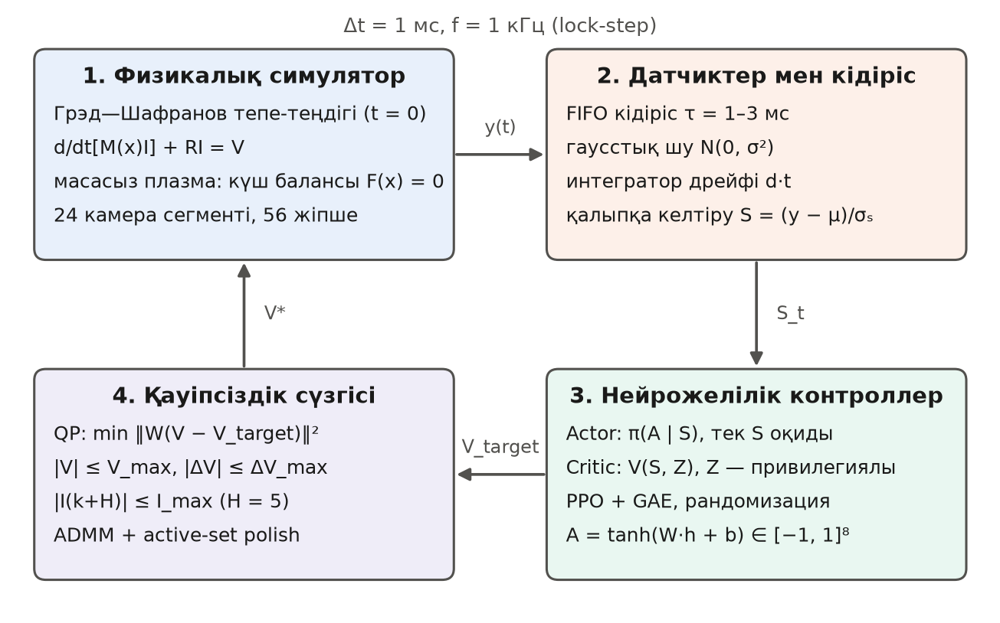

## 2. Зерттеу әдістемесі

### 2.1. Жүйе архитектурасы

Жабық контур төрт блоктан тұрады және 1-суретте көрсетілген. Симулятордың интегралдау қадамы мен нейрожелінің инференс жиілігі қатаң синхрондалған: Δt = 1 мс (f = 1 кГц). Әр қадамда симулятор плазма күйін береді, датчиктер эмуляторы оны кідіртіп, шу мен дрейф қосады, нейрожелі басқару әрекетін есептейді, қауіпсіздік сүзгісі кернеуді тексеріп түзетеді, содан кейін симулятор физикалық теңдеулерді Δt уақытқа алға интегралдайды. Блоктар арасында тек деректер келісімі (I/O контракт) беріледі: симулятордан контроллерге $[R_c, Z_c, I_p, \mathbf{I}_c, \boldsymbol\Psi, \mathbf{B}]$ (м, м, А, А, Вб, Тл), контроллерден симуляторға $[V_1,\dots,V_m]$ (В), екеуі де float64.

{width=14cm}

### 2.2. Физикалық симулятор (1-блок)

Симулятор қатаң ығысатын токты плазма (rigid-current-displacement) моделіне негізделген, ол тік тұрақсыздықты жобалауда қолданылатын RZIp класындағы модельдермен ұқсас [@lazarus; @ariola]. Бастапқы сәтте Грэд—Шафранов (2) теңдеуінің бекітілген шекарамен шешімі есептеледі [@wesson]: ол ток тығыздығы j_φ(R, Z), ішкі индуктивтілік l_i және β_p береді. Ток тығыздығы салмақтары сақталатын $N_f$ тороидалды жіпшелерге бөлінеді, олар ток центроиды $\mathbf{x}=(R_c, Z_c)$ бойымен бірге қозғалады.

Өткізгіштер: орталық соленоид (CS), алты PF катушкасы, қарама-қарсы тізбектелген екі орамнан тұратын тік тұрақтандыру (VS) жұбы және D-тәрізді вакуум камерасының 24 сегменті (болат, қалыңдығы 4 мм). Барлық өткізгіштер және плазма өзара индуктивтілік матрицасы арқылы байланысады, ол екі коаксиалды ілмектің өзара индуктивтілігінің тұйық формулаларынан есептеледі:

$$M(R_1,Z_1;R_2,Z_2)=\mu_0\sqrt{R_1R_2}\left[\left(\frac{2}{k}-k\right)K(k)-\frac{2}{k}E(k)\right],\qquad k^{2}=\frac{4R_1R_2}{(R_1+R_2)^2+(Z_1-Z_2)^2}, \tag{5}$$

мұнда K, E — толық эллипстік интегралдар. Өріс осы функцияның туындысынан алынады ($B_R=-\frac{1}{2\pi R}\partial_Z\Psi$, $B_Z=\frac{1}{2\pi R}\partial_R\Psi$); бұл байланыс сынақтарда ақырлы айырымдармен тексерілген. Электр тізбегі матрицалық теңдеумен сипатталады:

$$\frac{d}{dt}\big[\mathbf{M}(\mathbf{x})\,\mathbf{I}\big]+\mathbf{R}\,\mathbf{I}=\mathbf{V},\qquad \mathbf{I}=\mathrm{col}(\mathbf{I}_c,\ \mathbf{I}_v,\ I_p),\quad \mathbf{V}=\mathrm{col}(\mathbf{V}_c,\ \mathbf{0},\ 0). \tag{6}$$

Теңдеу $\mathbf{M}\,d\mathbf{I}/dt$ түрінде емес, $d(\mathbf{M}\mathbf{I})/dt$ түрінде жазылған: қозғалатын плазманың қозғалыс ЭҚК-і осы жерде сақталады, ал тік ығысуға қарсы әсер ететін камера тоқтарын дәл сол тудырады.

Плазманың Альфвен уақыты бір микросекундтан аспайды, яғни басқару қадамынан кемінде үш ретке кіші, сондықтан плазма массасыз деп алынады және $\mathbf{x}$ динамикалық айнымалы емес, күш балансының түбірі болады:

$$F_R=2\pi I_p\sum_f w_f R_f B_Z^{\mathrm{ext}}(f)+\frac{\mu_0 I_p^{2}}{2}\Lambda=0,\qquad F_Z=-2\pi I_p\sum_f w_f R_f B_R^{\mathrm{ext}}(f)=0, \tag{7}$$

$$\Lambda=\ln\frac{8R_c}{a\sqrt{\kappa}}+\beta_p+\frac{l_i}{2}-\frac32. \tag{8}$$

Бұл — Шафранов бойынша сақина мен тор түтікшесінің күші [@shafranov], сыртқы өрістің күшіне қарсы тұрады. Созылған плазма Z бойынша **тұрақсыз** түбірде орналасады; одан қашуды вакуум камерасының L/R уақытына дейін баяулататын — камерада индукцияланған ток. Интегралдау үшін жасырын Эйлер әдісі қолданылады: әр ішкі қадамда $(\mathbf{M}(\mathbf{x}_{n+1})+h\mathbf{R})\,\mathbf{I}_{n+1}=\mathbf{M}(\mathbf{x}_n)\,\mathbf{I}_n+h\mathbf{V}_n$, мұнда жаңа тоқтар $\mathbf{I}_{n+1}$ жаңа орынға қатысты сызықты, сондықтан тек екі өлшемді $\mathbf{x}_{n+1}$ түбірі хорда-Ньютон әдісімен ізделеді. Бастапқы катушка тоқтары қалыпты күш балансы мен мақсатты шекарадағы изоағын шартынан регуляризацияланған ең кіші квадраттар әдісімен табылады.

Қондырғы параметрлері КТМ-ның жобалық мәндерінен (шамамен) алынған; катушкалар жиыны машинаға масштабталған **жалпы** схема, нақты инженерлік геометрия емес. Параметрлер 2-кестеде келтірілген.

**2-кесте.** Модельденетін құрылғының параметрлері

| Шама | Мәні |
|:--------------------------|:----------------------------------|
| Үлкен / кіші радиус, R₀ / a | {{device.R0|.2f}} м / {{device.a|.2f}} м |
| Созылу / үшбұрыштылық, κ / δ | {{device.kappa|.2f}} / {{device.delta|.2f}} |
| Тороидалды өріс B₀, плазма тогы I_p | {{device.B0|.1f}} Тл, {{device.Ip_MA|.2f}} МА |
| l_i, β_p, q₉₅ (ГШ шешімі) | {{device.li|.2f}}, {{device.beta_p|.2f}}, {{device.q95|.2f}} |
| Басқару тізбектері | CS, PF1–PF6, VS (барлығы {{device.act_dim}}) |
| Камера сегменттері, плазма жіпшелері | {{device.n_vessel}}, {{device.n_filaments}} |
| Ағын ілмектері, магниттік зондтар | {{device.n_loops}}, {{device.n_probes}} |
| Тік тұрақсыздықтың өсу жылдамдығы γ | {{device.growth_rate|.0f}} с⁻¹ (сызықты талдау бойынша {{device.linear_growth_rate|.0f}} с⁻¹) |
| Плазма мен қабырға арасындағы ең аз саңылау | {{device.wall_gap_min_mm|.0f}} мм |

### 2.3. Датчиктер мен кідіріс эмуляторы (2-блок)

Нақты өлшемдерді модельдеу үшін симулятордың $\mathbf{y}$ векторы FIFO-буфер арқылы $d$ қадамға кідіртіледі ($d\in\{1,2,3\}$, эпизод басында кездейсоқ таңдалады), оған гаусстық шу мен магниттік арналардағы интегратордың сызықтық дрейфі қосылады:

$$\tilde{\mathbf{y}}(t)=\mathbf{y}(t-d\,\Delta t)+\boldsymbol{\delta}\,t+\boldsymbol{\eta}(t),\qquad \boldsymbol\eta\sim\mathcal{N}(\mathbf{0},\boldsymbol\Sigma), \tag{9}$$

мұнда δ — дрейф жылдамдығы (ағын ілмектері мен зондтар үшін, эпизод сайын қалыпты үлестіммен таңдалады, шамасы масштабтың 0,2 %/с). Стандартты ауытқулар: орын үшін 1 мм, I_p үшін 0,2 %, катушка тоқтары үшін шектің 0,2 %, ағын үшін 0,1 %, өріс үшін 0,5 % (тиісті масштабтан). Нейрожеліге беру үшін шамалар өлшемсіз бірліктерге келтіріледі:

$$\mathbf{S}=(\tilde{\mathbf{y}}-\boldsymbol\mu)/\boldsymbol\sigma_s, \tag{10}$$

мұнда μ — бастапқы тепе-теңдіктің мәні, σ_s — әр арна класының тұрақты физикалық масштабы (жүгіртілетін статистика емес, сондықтан бірдей өлшем әрдайым бірдей кірісті береді). CS рампасының жалпы ағыны барлық ілмектерді шкаладан шығарып жібермеу үшін ағын ілмектері өз орташасынан айырма ретінде беріледі. Желінің кірісі: 39 өлшем ($R_c, Z_c, I_p$, 8 катушка тогы, 12 ағын, 16 өріс), 3 қателік ($R_c-R_{\mathrm{ref}}$, $Z_c-Z_{\mathrm{ref}}$, $I_p-I_p^{\mathrm{ref}}$) және алдыңғы әрекет (8), барлығы {{device.obs_dim}} өлшем.

### 2.4. Қауіпсіздік сүзгісі (4-блок)

Нейрожелі әрекеті $\mathbf{A}_t\in\mathbb{R}^{m}$, $\Vert\mathbf{A}_t\Vert_\infty\le 1$ нысаналы кернеуге айналады: $\mathbf{V}_{\mathrm{target}}=\mathbf{V}_{\mathrm{ff}}+\mathbf{V}_{\max}\odot\mathbf{A}_t$, мұнда $\mathbf{V}_{\mathrm{ff}}$ — тепе-теңдік тоқтарын ұстайтын және плазманың кедергілік кернеуін CS рампасымен беретін номиналды кернеу (тек номиналды кедергілерден есептеледі). Кернеу күштік түрлендіргішке дейін QP-проекциядан өтеді (түзетілген, «қауіпсіз» кернеу $\mathbf{V}_{\mathrm{s}}$ деп белгіленген):

$$\mathbf{V}_{\mathrm{s}}=\arg\min_{\mathbf{V}}\ \tfrac12\big\Vert \mathbf{W}(\mathbf{V}-\mathbf{V}_{\mathrm{target}})\big\Vert^{2},\qquad \mathbf{W}=\mathrm{diag}(1/V_{\max,j}), \tag{11}$$

$$\max(-\mathbf{V}_{\max},\ \mathbf{V}_{\mathrm{prev}}-\Delta\mathbf{V})\ \le\ \mathbf{V}\ \le\ \min(\mathbf{V}_{\max},\ \mathbf{V}_{\mathrm{prev}}+\Delta\mathbf{V}),\qquad -\mathbf{I}_{\max}\le \mathbf{a}+\mathbf{B}\mathbf{V}\le \mathbf{I}_{\max}. \tag{12}$$

Бірінші қатар — қорек көзінің кернеу шегі және оның өзгеру жылдамдығы ($\Delta V=0{,}4\,V_{\max}$ бір қадамда). Екіншісі — катушка тогының $H=5$ қадамнан кейінгі шегі: $\mathbf{I}_c(k+H)=\mathbf{a}+\mathbf{B}\mathbf{V}$ — $\mathbf{V}$ бойынша сызықты, өйткені (6) теңдеу тоққа қатысты сызықты (плазма орны қатыртылған, кернеу $H$ қадам бойы тұрақты деп алынады). Әр катушка үшін $h_j(\mathbf{V})=I_{\max,j}-|I_{j}(k+H)|\ge 0$ шарты (3) шартының дискретті уақыттағы болжамды түрі болып табылады. QP есебі ADMM әдісімен (OSQP итерациясы [@osqp], бейімделгіш қадам) шешіліп, белсенді жиында дәл шешіммен «жылтыратылады»; кездейсоқ есептерде нәтиже SLSQP-пен 10⁻¹³ дәлдікпен сәйкес келеді (сынақ). Сұралған әрекет қауіпсіз болса, сүзгі оны өзгертпейді. Ток шегі орындалмайтын болса (катушка шектен асып кеткен), әр жолдың шекаралары кернеу жәшігімен қол жеткізуге болатын аймаққа қиылады, сондықтан сүзгі сәтсіздікке ұшырамай, қорек көзі мүмкіндігінше кері итереді. Сүзгінің ток болжамы номиналды кедергілермен есептеледі, яғни плант параметрлерінің шамасы белгісіз болғанда **кепілдік емес, болжам** береді; бұл 3.4-бөлімде өлшенеді.

### 2.5. Марапаттау функциясы және тоқтату шарттары

Бір қадамдағы марапаттау плазманың орнын, шекара пішінін және токты ұстау сапасын, сондай-ақ басқарудың тегістігі мен сүзгіге тәуелділікті бағалайды:

$$r_t=0{,}4\,e^{-(e_{\mathrm{pos}}/\sigma)^2}+0{,}3\,e^{-(e_{\mathrm{sh}}/\sigma)^2}+0{,}3\,e^{-\left(\frac{I_p-I_p^{\mathrm{ref}}}{0{,}01\,I_p^{\mathrm{ref}}}\right)^{2}}-\frac{0{,}1}{m}\Vert\mathbf{A}_t-\mathbf{A}_{t-1}\Vert^{2}-\frac{0{,}1}{m}\Vert\mathbf{W}(\mathbf{V}_{\mathrm{s}}-\mathbf{V}_{\mathrm{target}})\Vert^{2}-50\cdot\mathbb{1}_{\mathrm{term}}, \tag{13}$$

мұнда σ = 1 см, $e_{\mathrm{pos}}=\Vert(R_c,Z_c)-(R_{\mathrm{ref}},Z_{\mathrm{ref}})\Vert$, ал $e_{\mathrm{sh}}$ — мақсатты шекарадағы 16 нүктеде өлшенген изоағын қатесінің ($(\Psi_k-\bar\Psi)/(2\pi R|B_p|)$, м) RMS мәні, қатаң ығысу алынып тасталған. Бір қадамдағы марапаттаудың жоғарғы шегі — 1. Эпизод бірден тоқтатылады және айыппұл салынады, егер: плазма шекарасы мен камера арасындағы ең қысқа қашықтық ≤ 2 см (қабырғамен жанасу), $|dI_p/dt|>10^{7}$ А/с (ток өшуі), $|Z_c|>0{,}30$ м немесе күш балансының түбірі жоғалса (VDE).

### 2.6. Нейрожелілік контроллер және оқыту (3-блок)

Актор — екі жасырын қабаты (128 × 128, tanh) бар тікелей таралатын желі, ал саясат гаусстық: $\pi_\theta(\mathbf{A}|\mathbf{S})=\mathcal{N}(\boldsymbol\mu_\theta(\mathbf{S}),\mathrm{diag}\,\boldsymbol\sigma^2)$, $\boldsymbol\mu_\theta=\tanh(\mathbf{W}_L\mathbf{h}+\mathbf{b}_L)$. Қолданыста тек орташа $\boldsymbol\mu_\theta$ пайдаланылады. Критик — сондай құрылымды желі $V_\phi$. Оқыту PPO [@ppo] арқылы жүргізіледі:

$$L^{\mathrm{CLIP}}(\theta)=\mathbb{E}_t\Big[\min\big(\rho_t(\theta)\hat{A}_t,\ \mathrm{clip}(\rho_t(\theta),1-\epsilon,1+\epsilon)\hat{A}_t\big)\Big],\qquad \rho_t(\theta)=\frac{\pi_\theta(\mathbf{A}_t|\mathbf{S}_t)}{\pi_{\theta_{\mathrm{old}}}(\mathbf{A}_t|\mathbf{S}_t)}, \tag{14}$$

ал артықшылық функциясы жалпыланған артықшылық бағасымен (GAE) [@gae] есептеледі:

$$\delta_t=r_t+\gamma V_\phi(\cdot_{t+1})(1-d_t)-V_\phi(\cdot_t),\qquad \hat{A}_t=\sum_{l\ge 0}(\gamma\lambda)^{l}\delta_{t+l}. \tag{15}$$

Уақыт шегіне жеткен эпизод $V_\phi$ арқылы бутстрапталады, ал нақты тоқтату (VDE, қабырға, ток өшуі) болашақты нөлдейді. Градиенттер қолмен жазылған және ақырлы айырымдармен тексерілген. Гиперпараметрлер: γ = 0,99, λ = 0,95, ε = 0,2, 8 эпоха, мини-батч 512, Adam, lr = 10⁻⁴, мақсатты KL = 0,02 (1,5 есе асқанда эпоха тоқтатылады), бастапқы log σ = −2,5, жиын 2048 қадам, барлығы 10⁵ қадам.

Ашық контурда ($\mathbf{A}=0$) плазма қабырғаға тиіп жоғалады (3-бөлім), яғни оқуды кездейсоқ саясатпен бастағанда тәжірибе қысқа, терминалмен аяқталатын эпизодтардан тұрады. Сондықтан актор алдымен классикалық реттегіштің (2.7-бөлім) әрекеттеріне клондалады (20 эпизод; орындалатын әрекетке шу қосылады, бірақ белгі ретінде шусыз әрекет алынады), ал критик дисконтталған қайтарымдарға бейімделеді.

**Рандомизация.** Әр эпизод басында плант параметрлері кездейсоқ таңдалады: вакуум камерасының кедергісі $\kappa_w\sim\log\mathcal{U}(0{,}7;\,1{,}5)$, плазма кедергісі $\kappa_p\sim\log\mathcal{U}(0{,}5;\,2)$ (номиналға қатысты) және қорек көзінің күшейту қателігі $g\sim\mathcal{U}(0{,}85;\,1{,}15)$ (қолданылатын кернеу / сұралатын кернеу). Датчик кідірісі, шу, дрейф және бұзылу оқиғалары барлық нұсқада рандомизацияланады; нұсқалар плант параметрлері мен критик құрылымы бойынша ғана ерекшеленеді. Контроллерге, ал сондай-ақ номиналды кернеуге, сүзгінің болжамына және классикалық реттегіштің жобасына таңдалған мәндер белгісіз. Қосымша бұзылулар: VS жұбына бастапқы ток соққысы, бір эпизодта β_p мен l_i өзгеретін оқиға (ықтималдық 0,7, 10 мс ішінде β_p 0–10 %-ға кемиді, l_i ±3 %-ға өзгереді) және тірек секірісі (ықтималдық 0,5; R бойынша ±1 см, Z бойынша ±2 см).

**Асимметриялы критик.** Критик оқу кезінде ғана қолжетімді $\mathbf{Z}_t$ жасырын күйін қосымша кіріс ретінде алады: $V_\phi(\mathbf{S}_t,\mathbf{Z}_t)$. Онда кідірістен және шудан таза $R_c, Z_c, I_p$, катушка тоқтары, 24 камера тогы, $l_i$ мен $\beta_p$ ауытқулары, эпизодтың плант параметрлері ($\ln\kappa_w$, $\ln\kappa_p$, $g-1$) және датчик кідірісі бар ({{device.priv_dim}} өлшем). Актор тек аппараттық интерфейсте бар $\mathbf{S}_t$ кірісін ({{device.obs_dim}} өлшем) көреді, сондықтан орналастыру кезінде критик қажет емес.

### 2.7. Классикалық базалық реттегіш

Салыстыру әділ болу үшін классикалық реттегіш сол плантқа арнап жобаланды және ол да тек нейрожеліге берілетін шулы, кідіртілген өлшемдерді пайдаланады. Құрылымы: (i) тік бағытта — VS қорек көзінің кернеуіне ПД-реттегіш, $V_{VS}=V_{\mathrm{ff}}-k_p e_Z-k_d\dot e_Z$; (ii) радиалды бағытта — $R_c$ бойынша ПИ, PF тоқтарының радиалды ығысуды тудыратын (тік ығысуды тудырмайтын) ең кіші нормалы өрнегі бойынша; (iii) $I_p$ үшін CS рампасына түзету; (iv) VS тогын PF катушкаларына жай «түсіру» (VS-ке ток шегінен шығып кетпеуге мүмкіндік беру).

Күшейту коэффициенттері баптаумен емес, **жобалау** арқылы алынды. Симулятордың бір қадамы номиналды плант үшін ақырлы айырымдармен сызықтандырылды: $\mathbf{I}_{n+1}=\mathbf{A}\mathbf{I}_n+\mathbf{B}\mathbf{V}_n$, $\mathbf{x}_n=\mathbf{x}_0+\mathbf{C}(\mathbf{I}_n-\mathbf{I}_0)$. Кідіріс $d$ қадам ығысу регистрі ретінде күй векторына қосылды, ал тұйық жүйенің спектрлік радиусы барлық $d\in\{1,2,3\}$ және төрт жұмыс нүктесі (бастапқы нүкте, CS рампасының эпизод соңындағы тогы, β_p мен l_i өзгерген екі нүкте) бойынша есептелді. Гиперпараметрлер торында тұрақты аймақтың ең терең нүктесі, яғни тұрақсыз жұптан ең алыс нүкте таңдалды. Баяу тізбек режимдері барлық тұрақты коэффициенттерде $|z|=1$ шамасында болатындықтан, «ең кіші спектрлік радиус» критерийі жарамсыз екені анықталды.

### 2.8. Бағалау хаттамасы

Барлық бағалау 30 жұптасқан сидте жүргізіледі (5000–5029; оқу кезінде қолданылмайды): сид бұзылулар тізбегін, шуды, кідірісті және плант параметрлерін анықтайды, сондықтан контроллерлер бірдей эпизодтарда салыстырылады. Эпизод ұзақтығы 500 мс. Көрсеткіштер: аман қалу үлесі (плазма жоғалмаған эпизодтар), аман қалған эпизодтардағы RMS орын қатесі, RMS пішін қатесі, эпизод қайтарымы, QP сүзгісінің араласу үлесі және ток шегі бұзылған қадамдардың үлесі. Контроллерлерді салыстыру үшін жұптасқан Уилкоксон критерийі [@wilcoxon] қолданылады. Қолданылған контроллерлер: классикалық реттегіш (ПИД), ашық контур ($\mathbf{A}=0$) және үш PPO нұсқасы: **PPO-0** (симметриялы критик, рандомизациясыз), **PPO-DR** (симметриялы критик, рандомизациямен), **PPO-DR-AC** (асимметриялы критик, рандомизациямен). Үш нұсқа бірдей клондау процедурасымен (20 демонстрация), гиперпараметрлермен және қадам санымен оқытылды; олар тек рандомизация мен критик құрылымы жағынан ерекшеленеді.
