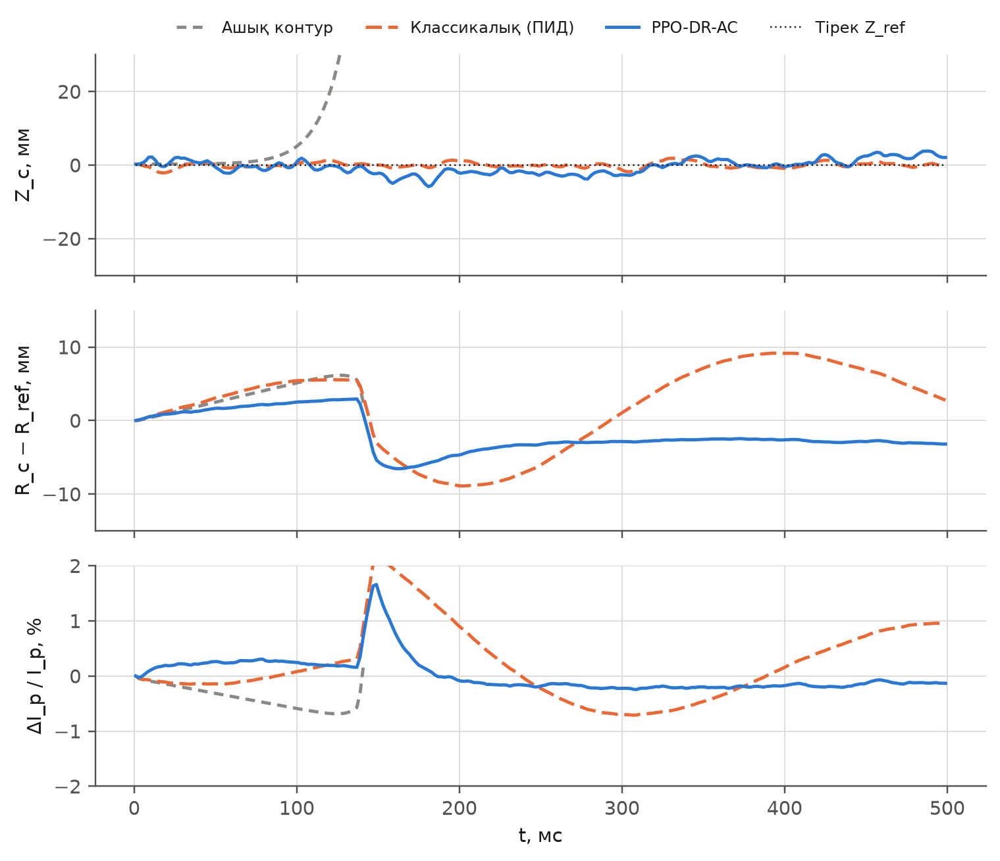
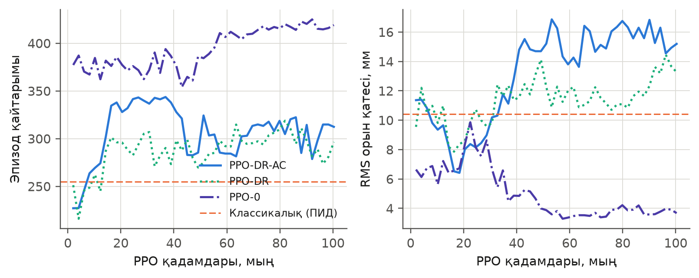
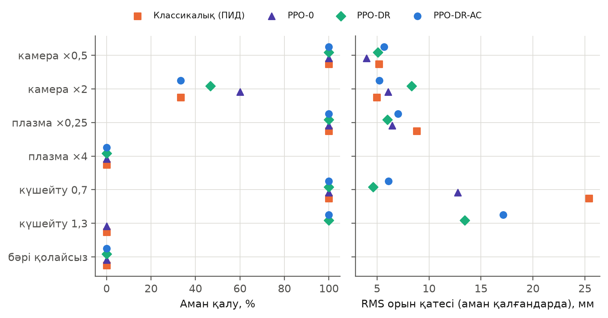
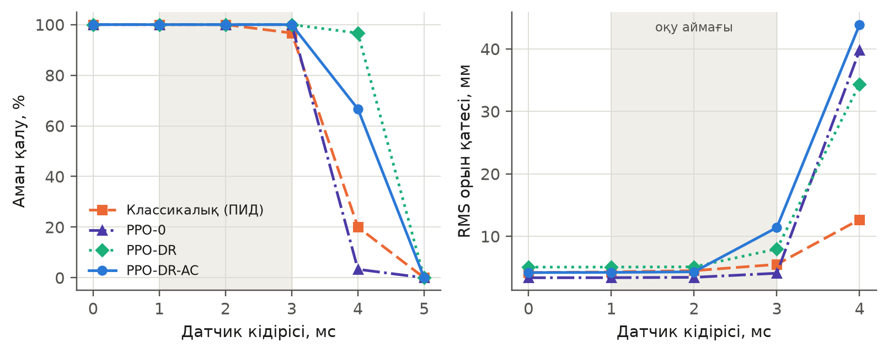
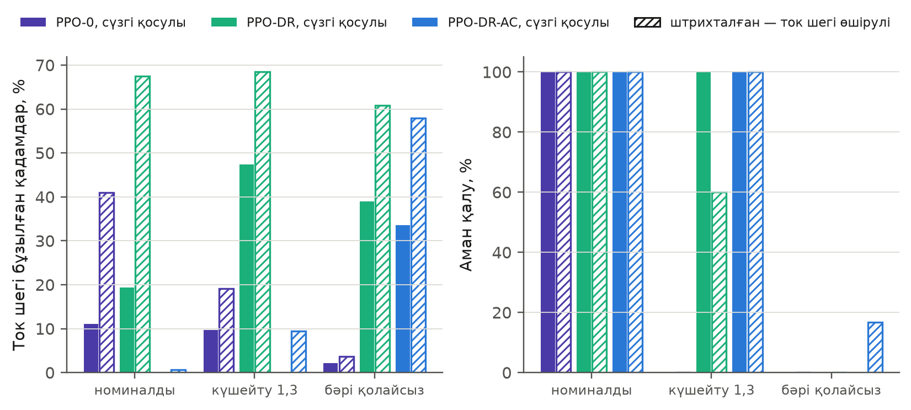
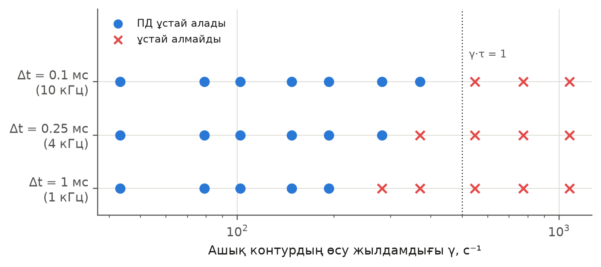

## 3. Зерттеу нәтижелері

### 3.1. Плант және ашық контур

2-кестеде сипатталған құрылғы үшін тік тұрақсыздықтың ашық контурдағы өсу жылдамдығы $\gamma= {{device.growth_rate|.0f}}$ с⁻¹ (уақыттық интегралдау бойынша), ал сызықтандырылған модельде {{device.linear_growth_rate|.0f}} с⁻¹. Бұл шамалар арасындағы {{= pm(abs(r['device']['linear_growth_rate']-r['device']['growth_rate'])/r['device']['growth_rate']*100, '.0f') }} % айырма сызықтандыру қадамының ақырлы болуымен түсіндіріледі. Яғни ашық контурда ауытқу шамамен {{= pm(1000/r['device']['growth_rate'], '.0f') }} мс ішінде $e$ есе өседі.

Ашық контурда ($\mathbf{A}=0$, тек номиналды $\mathbf{V}_{\mathrm{ff}}$) номиналды плантта 30 эпизодтың {{= round((1-r['main']['open_loop']['nominal']['survival'])*r['main']['open_loop']['nominal']['n']) }}-інде плазма жоғалды; орта есеппен эпизод {{= pm(np.mean([e['steps'] for e in r['main']['open_loop']['nominal']['episodes']]), '.0f') }} мс-тан кейін тоқтатылды (3-сурет). Рандомизацияланған плантта ашық контур 30 эпизодтың {{= round(r['main']['open_loop']['randomised']['survival']*r['main']['open_loop']['randomised']['n']) }}-інде ғана аман қалды. Бұл нәтиже модельдің мақсатты қасиетін растайды: белсенді басқарусыз тұрақсыз тепе-теңдік сақталмайды.

{width=14cm}

### 3.2. Негізгі салыстыру

3-кестеде барлық контроллер екі шартта салыстырылған: номиналды плантта және оқу таралымынан алынған рандомизацияланған плантта (30 жұптасқан сид).

**3-кесте.** Контроллерлердің сапасы («рандом.» — рандомизацияланған плант; орта мән; e_pos және e_sh аман қалған эпизодтарда; қайтарым — орта ± стандартты қате)

{{table:main}}

*Номиналды плант.* Үш PPO нұсқасы да, ПИД те барлық 30 эпизодта плазманы ұстады. 0-сидте **PPO-0** ең жоғары қайтарымды ({{= pm(r['main']['PPO-0']['nominal']['return_mean'], '.0f') }}) және ең аз орын қатесін ({{= pm(r['main']['PPO-0']['nominal']['pos_mm_mean'], '.1f') }} мм) көрсетті; ПИД-пен салыстырғанда қате {{= pm(r['main']['PID']['nominal']['pos_mm_mean']-r['main']['PPO-0']['nominal']['pos_mm_mean'], '.1f') }} мм кіші ({{= pval(paired_p(r,'main','PPO-0','PID','nominal','rms_position_error_mm')) }}, жұптасқан Уилкоксон критерийі). Бірақ ол QP-сүзгіге қадамдардың {{= pct(r['main']['PPO-0']['nominal']['qp_frac']) }}-інде сүйенеді. **PPO-DR-AC** қайтарымы ПИД-тен статистикалық ажыратылмайды ({{= pval(paired_p(r,'main','PPO-DR-AC','PID','nominal')) }}), ал орын қатесі {{= pm(r['main']['PPO-DR-AC']['nominal']['pos_mm_mean']-r['main']['PID']['nominal']['pos_mm_mean'], '.1f') }} мм артық ({{= pval(paired_p(r,'main','PPO-DR-AC','PID','nominal','rms_position_error_mm')) }}); сонымен қатар ол сүзгіні тек {{= pct(r['main']['PPO-DR-AC']['nominal']['qp_frac']) }} қадамда пайдаланады. Бұл — 0-оқыту сидінің нәтижесі; үш сид бойынша қайталануы 3.3-бөлімде тексеріледі.

*Рандомизацияланған плант.* ПИД-тің аман қалуы {{= pct(r['main']['PID']['randomised']['survival']) }}-ке ({{= round(r['main']['PID']['randomised']['survival']*30) }}/30), ал орын қатесі {{= pm(r['main']['PID']['randomised']['pos_mm_mean'], '.0f') }} мм-ге дейін өсті. PPO нұсқалары 30 эпизодтың {{= round(r['main']['PPO-0']['randomised']['survival']*30) }} (PPO-0), {{= round(r['main']['PPO-DR']['randomised']['survival']*30) }} (PPO-DR) және {{= round(r['main']['PPO-DR-AC']['randomised']['survival']*30) }} (PPO-DR-AC) эпизодында плазманы ұстап, қайтарым бойынша ПИД-ті асып түсті ({{= pval(paired_p(r,'main','PPO-DR-AC','PID','randomised')) }}). Үш PPO нұсқасының бір-бірінен айырмашылығы статистикалық маңызды емес: PPO-DR-AC және PPO-DR үшін {{= pval(paired_p(r,'main','PPO-DR-AC','PPO-DR','randomised')) }}, PPO-DR және PPO-0 үшін {{= pval(paired_p(r,'main','PPO-DR','PPO-0','randomised')) }}.

*Барлық контроллер жоғалтқан эпизодтар.* Рандомизацияланған 30 сидтің {{= len(fail_all(r)) }}-інде төрт контроллердің барлығы плазманы жоғалтты: {{= '; '.join(draw_text(r, i) for i in fail_all(r)) }}. Екеуінде де датчик кідірісі ең үлкен мәнге (3 мс) тең болды. ПИД пен PPO-DR-AC үшін жеке тексеруде плазма 165–279 мс-та жоғалды, ал VS қорегінің кернеуі шекке жеткен жоқ (|V| > 0,98 V_max болған қадам жоқ). Яғни себеп қуаттың жетіспеуі емес; кідіріспен біріктірілген тұрақсыздық шегі болуы мүмкін деп болжауға болады (3.7-бөлім), бірақ мұны тікелей дәлелдейтін өлшем жүргізілмеді. Осыған байланысты рандомизацияланған плантта барлық контроллердің аман қалуы {{= round(max(r['main'][k]['randomised']['survival'] for k in ('PPO-0','PPO-DR','PPO-DR-AC'))*30) }}/30-дан жоғары бола алмады.

### 3.3. Оқыту нұсқалары және қайта оқытуға төзімділік

2-суретте оқу қисықтары көрсетілген. Асимметриялы критик (PPO-DR-AC) нақты күйді көретіндіктен оның түсіндірілген дисперсиясы 20 мың қадамнан кейін орта есеппен {{= pm(r['training']['PPO-DR-AC']['ev_mean_late'], '.2f') }} (аралығы {{= pm(r['training']['PPO-DR-AC']['ev_min_late'], '.2f') }}–{{= pm(r['training']['PPO-DR-AC']['ev_max'], '.2f') }}), симметриялы критик (PPO-DR) үшін — {{= pm(r['training']['PPO-DR']['ev_mean_late'], '.2f') }} ({{= pm(r['training']['PPO-DR']['ev_min_late'], '.2f') }}–{{= pm(r['training']['PPO-DR']['ev_max'], '.2f') }}) болды. Рандомизацияланған бағалау сидтерінде ең жақсы қайтарым PPO-DR-AC үшін {{= pm(r['training']['PPO-DR-AC']['best_return'], '.0f') }} ({{= r['training']['PPO-DR-AC']['best_step'] // 1000 }} мың қадамда), PPO-DR үшін {{= pm(r['training']['PPO-DR']['best_return'], '.0f') }} ({{= r['training']['PPO-DR']['best_step'] // 1000 }} мың қадамда), ал клондалған ПИД үшін {{= pm(r['training']['PPO-DR']['expert_return'], '.0f') }} болды. PPO-DR-AC қисығы ең жоғарғы нүктеден кейін төмендеп, оқудың соңында RMS орын қатесі {{= pm(r['training']['PPO-DR-AC']['final_pos_mm'], '.0f') }} мм-ге дейін өсті. Мұндай қатеде (13) формуласындағы орын құрамдасы (салмағы 0,4) $e^{-1{,}5^{2}}\approx 0{,}1$-ге дейін кемиді, ал ток пен пішін құрамдастары сақталады; демек, саясат орын дәлдігінен гөрі ток пен пішінді ұстауға бейімделген болуы мүмкін. Сондықтан сақталған саясат — ең жақсы бағаланған нүкте, соңғы емес (2.6-бөлім); таңдау тек 6 сидте жасалғандықтан, оған шу әсер етуі мүмкін, ал бұл 4-кестеде тексеріледі.

{width=15cm}

Бір оқыту сидіндегі айырмашылықтар сид шуынан болуы мүмкін, сондықтан әр нұсқа тағы екі сидпен қайта оқытылды (4-кесте).

**4-кесте.** Қайта оқытуға төзімділік: әр нұсқа және оқыту сиді үшін RMS орын қатесі, мм (аман қалған / барлығы)

{{table:seeds}}

Қайта оқыту нәтижелерінен алты бақылау шығады (4-кесте).

*Алдымен*, номиналды плантта RMS орын қатесі (мм) үш сид бойынша: PPO-0 — {{= sl(r,'PPO-0','nominal','pos_mm_mean',1,1) }}; PPO-DR — {{= sl(r,'PPO-DR','nominal','pos_mm_mean',1,1) }}; PPO-DR-AC — {{= sl(r,'PPO-DR-AC','nominal','pos_mm_mean',1,1) }}; ПИД — {{= pm(r['main']['PID']['nominal']['pos_mm_mean'], '.1f') }}. Орта есеппен PPO-0 ({{= smean(r,'PPO-0','nominal','pos_mm_mean',1,1) }} мм) ПИД-пен тең деңгейде: 0-сидтегі 1 мм артықшылық қайталанбады. Рандомизацияланған нұсқалар (PPO-DR — {{= smean(r,'PPO-DR','nominal','pos_mm_mean',1,1) }} мм, PPO-DR-AC — {{= smean(r,'PPO-DR-AC','nominal','pos_mm_mean',1,1) }} мм) шамамен 1 мм нашар. Қайтарым бойынша (ол ток пен пішін құрамдастарын да қамтиды) PPO-0 — {{= sl(r,'PPO-0','nominal','return_mean',1,0) }}, PPO-DR — {{= sl(r,'PPO-DR','nominal','return_mean',1,0) }}, PPO-DR-AC — {{= sl(r,'PPO-DR-AC','nominal','return_mean',1,0) }}, ПИД — {{= pm(r['main']['PID']['nominal']['return_mean'], '.0f') }}.

*Біріншіден*, қорек көзінің күшейтуі 1,3 болғанда (оқу ауқымынан тыс) рандомизацияланған нұсқалар үш сидтің үшеуінде де плазманы ұстады: PPO-DR — {{= sl(r,'PPO-DR','gain 1.3') }}, PPO-DR-AC — {{= sl(r,'PPO-DR-AC','gain 1.3') }} эпизод (30-дан). Рандомизациясыз PPO-0 үшін — {{= sl(r,'PPO-0','gain 1.3') }}: үш сидтің тек біреуі ұстады. Бұл айырма сидке тәуелді емес, сондықтан рандомизацияның қорек көзінің қателігі бойынша пайдасы қайталанатын нәтиже деп қабылдауға болады.

*Екіншіден*, камера кедергісі ×2 болғанда нұсқалар арасында жүйелі айырма жоқ: PPO-0 — {{= sl(r,'PPO-0','wall x2') }}, PPO-DR — {{= sl(r,'PPO-DR','wall x2') }}, PPO-DR-AC — {{= sl(r,'PPO-DR-AC','wall x2') }} (30-дан). Бір сидте PPO-0 ешбір эпизодты ұстай алмады, сондықтан 3.4-бөлімде 0-сидте байқалған PPO-0-дің артықшылығы қайталанбады.

*Үшіншіден*, датчик кідірісі 4 мс болғанда орта есеппен PPO-0 — {{= smean(r,'PPO-0','delay 4 ms') }}, PPO-DR — {{= smean(r,'PPO-DR','delay 4 ms') }}, PPO-DR-AC — {{= smean(r,'PPO-DR-AC','delay 4 ms') }} эпизод (30-дан), бірақ сидтер арасындағы өзгергіштік үлкен (PPO-0: {{= sl(r,'PPO-0','delay 4 ms') }}; PPO-DR: {{= sl(r,'PPO-DR','delay 4 ms') }}; PPO-DR-AC: {{= sl(r,'PPO-DR-AC','delay 4 ms') }}), сондықтан рандомизацияның пайдасы бұл жерде бағыт ретінде ғана көрінеді.

*Төртіншіден*, рандомизацияланған плантта QP-сүзгінің араласу үлесі PPO-DR үшін {{= sl(r,'PPO-DR','randomised','qp_frac',100) }} %, PPO-DR-AC үшін {{= sl(r,'PPO-DR-AC','randomised','qp_frac',100) }} %, PPO-0 үшін {{= sl(r,'PPO-0','randomised','qp_frac',100) }} %. 3.2-бөлімде 0-сидте байқалған айырма (асимметриялы критик сүзгіні сирек пайдаланады) қайталанбады: PPO-DR-тің басқа сидтері де сүзгіге сирек сүйенеді. Сондықтан асимметриялы критиктің сүзгіге тәуелділікті азайтатыны дәлелденбеді.

*Бесіншіден*, рандомизацияланған плантта аман қалу барлық нұсқада бірдей деңгейде: PPO-0 — {{= sl(r,'PPO-0','randomised') }}, PPO-DR — {{= sl(r,'PPO-DR','randomised') }}, PPO-DR-AC — {{= sl(r,'PPO-DR-AC','randomised') }} (30-дан); ПИД — {{= round(r['main']['PID']['randomised']['survival']*30) }}. Жоғалатын эпизодтар үш сидте де негізінен сол екі сид болып қалады (3.2-бөлім).

### 3.4. Оқу таралымынан тыс плант

5-кестеде және 4-суретте плант параметрлері оқу ауқымынан тыс мәндерге (камера кедергісі ×0,5 және ×2; плазма кедергісі ×0,25 және ×4; қорек көзінің күшейтуі 0,7 және 1,3) және олардың қолайсыз тіркесіміне ауыстырылған. Оқу ауқымы: камера ×0,7–1,5, плазма ×0,5–2, күшейту 0,85–1,15.

**5-кесте.** Оқу ауқымынан тыс плант: RMS орын қатесі, мм (аман қалған / барлығы)

{{table:ood}}

{width=15cm}

Нәтиже біртекті емес (бұл бөлімдегі сандар 0-оқыту сидіне қатысты; олардың қайталануы 3.3-бөлімде тексерілген). Қорек көзінің күшейтуін 1,3-ке дейін арттырғанда (оқу ауқымынан тыс) ПИД пен PPO-0 плазманы {{= round(r['ood']['PID']['gain 1.3']['survival']*30) }}/30 және {{= round(r['ood']['PPO-0']['gain 1.3']['survival']*30) }}/30 эпизодта ұстады, ал рандомизациямен оқытылған PPO-DR және PPO-DR-AC — {{= round(r['ood']['PPO-DR']['gain 1.3']['survival']*30) }}/30 және {{= round(r['ood']['PPO-DR-AC']['gain 1.3']['survival']*30) }}/30. Күшейту 0,7 болғанда барлық контроллер плазманы ұстады, бірақ орын қатесі ПИД үшін {{= pm(r['ood']['PID']['gain 0.7']['pos_mm_mean'], '.0f') }} мм, PPO-0 үшін {{= pm(r['ood']['PPO-0']['gain 0.7']['pos_mm_mean'], '.0f') }} мм, ал PPO-DR және PPO-DR-AC үшін {{= pm(r['ood']['PPO-DR']['gain 0.7']['pos_mm_mean'], '.0f') }} және {{= pm(r['ood']['PPO-DR-AC']['gain 0.7']['pos_mm_mean'], '.0f') }} мм. Плазма кедергісін ×0,25-ке түсіргенде рандомизацияланған нұсқалардың қайтарымы жоғары ({{= pm(r['ood']['PPO-DR']['plasma x0.25']['return_mean'], '.0f') }} және {{= pm(r['ood']['PPO-DR-AC']['plasma x0.25']['return_mean'], '.0f') }}, ал PPO-0 үшін {{= pm(r['ood']['PPO-0']['plasma x0.25']['return_mean'], '.0f') }}, ПИД үшін {{= pm(r['ood']['PID']['plasma x0.25']['return_mean'], '.0f') }}). Бұл — рандомизацияның пайдасын көрсететін жағдайлар. Қарама-қарсы мысал: камера кедергісі ×2 болғанда (өсу жылдамдығы артады) 0-сидте ең жақсы аман қалуды рандомизациясыз PPO-0 көрсетті ({{= round(r['ood']['PPO-0']['wall x2']['survival']*30) }}/30; ПИД — {{= round(r['ood']['PID']['wall x2']['survival']*30) }}/30, PPO-DR — {{= round(r['ood']['PPO-DR']['wall x2']['survival']*30) }}/30, PPO-DR-AC — {{= round(r['ood']['PPO-DR-AC']['wall x2']['survival']*30) }}/30). Плазма кедергісі ×4 және «барлығы қолайсыз» жағдайында ешбір контроллер плазманы ұстамады. Қайта оқытудан кейін (3.3-бөлім) тұрақты қалған тұжырым: рандомизация қорек көзінің күшейтуі бойынша төзімділікті арттырды; камера кедергісі бойынша жүйелі артықшылық жоқ; оқу ауқымынан едәуір тыс плантты ешбір әдіс ұстай алмады.

### 3.5. Датчик кідірісі

Оқу кезінде кідіріс 1–3 мс аралығында болды. 5-суретте және 6-кестеде номиналды плантта 0–5 мс кідіріс үшін нәтиже берілген.

**6-кесте.** Датчик кідірісі: RMS орын қатесі, мм (аман қалған / барлығы)

{{table:delay}}

{width=15cm}

Оқу ауқымында (0–3 мс) барлық контроллер тұрақты. Кідіріс 4 мс болғанда ПИД жобаланған ауқымнан шыққандықтан {{= round(r['delay']['PID']['4']['survival']*30) }}/30, PPO-0 — {{= round(r['delay']['PPO-0']['4']['survival']*30) }}/30 эпизодта ұстады; рандомизациямен оқытылған PPO-DR — {{= round(r['delay']['PPO-DR']['4']['survival']*30) }}/30, PPO-DR-AC — {{= round(r['delay']['PPO-DR-AC']['4']['survival']*30) }}/30. 5 мс кідірісте ешбір контроллер плазманы ұстамады. 0-сидте рандомизация плант параметрлері бойынша оқытылғанымен, кідіріс бойынша да экстраполяцияны жақсартты; үш сид бойынша бұл айырма азырақ айқын (3.3-бөлім, 4-кесте). 3 мс кідірісте PPO-DR-AC-тың орын қатесі ({{= pm(r['delay']['PPO-DR-AC']['3']['pos_mm_mean'], '.1f') }} мм) PPO-0-ден ({{= pm(r['delay']['PPO-0']['3']['pos_mm_mean'], '.1f') }} мм) және ПИД-тен ({{= pm(r['delay']['PID']['3']['pos_mm_mean'], '.1f') }} мм) артық, яғни оқу ауқымының шетінде консервативтірек болады.

### 3.6. Қауіпсіздік сүзгісінің рөлі

7-кестеде және 6-суретте бір саясаттар сүзгі қосулы және ток шегі өшірулі (кернеу мен оның өзгеру жылдамдығының шектері сақталады) жағдайда салыстырылған. «Шек бұзылды» — катушкалардың кез келгенінде $|I|>I_{\max}$ болған қадамдардың үлесі.

**7-кесте.** Сүзгінің әсері: аман қалу және ток шегінің бұзылуы

{{table:safety}}

{width=15cm}

Сүзгі ток шегінің бұзылуын едәуір азайтады: номиналды плантта PPO-0 үшін {{= pct(r['safety']['PPO-0']['nominal']['filter_off']['over_limit_frac']) }}-тен {{= pct(r['safety']['PPO-0']['nominal']['filter_on']['over_limit_frac']) }}-ке, PPO-DR үшін {{= pct(r['safety']['PPO-DR']['nominal']['filter_off']['over_limit_frac']) }}-тен {{= pct(r['safety']['PPO-DR']['nominal']['filter_on']['over_limit_frac']) }}-ке, ал ең үлкен асып кету $|I|/I_{\max}$ {{= pm(r['safety']['PPO-DR']['nominal']['filter_off']['max_I_over'], '.1f') }}-ден {{= pm(r['safety']['PPO-DR']['nominal']['filter_on']['max_I_over'], '.2f') }}-ке төмендейді. Алайда сүзгі шекті **толық кепілдемейді**: PPO-0 және PPO-DR үшін оның қосулы күйінде де шек {{= pct(r['safety']['PPO-0']['nominal']['filter_on']['over_limit_frac']) }} және {{= pct(r['safety']['PPO-DR']['nominal']['filter_on']['over_limit_frac']) }} қадамда бұзылады (номиналды плантта асып кету 4 %-дан аспайды). Диагностикалық жүгіруде (PPO-0 және PPO-DR-AC, номиналды плант, 6 сид) бұзылу тек VS катушкасында болды (CS және PF катушкаларының тоғы шектің 0,6 бөлігінен аспады); оның себебі — сүзгінің болжамы плазма орнын қатырады, ал VS тогына плазманың қозғалысы мен камера тоқтары да әсер етеді (2.4-бөлім). Сүзгісіз күйде PPO-DR қорек күшейтуі 1,3 болғанда аман қалуды {{= pct(r['safety']['PPO-DR']['gain 1.3']['filter_on']['survival']) }}-тен {{= pct(r['safety']['PPO-DR']['gain 1.3']['filter_off']['survival']) }}-ке дейін төмендетті. 0-сидтегі PPO-DR-AC қалыпты плантта сүзгісіз де тоқтың шегін {{= pct(r['safety']['PPO-DR-AC']['nominal']['filter_off']['over_limit_frac'], 1) }} қадамда ғана бұзды; бұл асимметриялы критикке тән қасиет емес болуы мүмкін, өйткені сүзгі қосулы кезде PPO-DR-дің басқа сидтері де шекті бұзбайды (3.3-бөлім, 4-кесте). Сонымен бірге «барлығы қолайсыз» жағдайда сүзгісіз PPO-DR-AC эпизодтардың {{= pct(r['safety']['PPO-DR-AC']['all adverse']['filter_off']['survival']) }}-ін аман өткізді, сүзгімен — {{= pct(r['safety']['PPO-DR-AC']['all adverse']['filter_on']['survival']) }}: сүзгі қауіпсіздікті қамтамасыз ету үшін тоқ шегін ұстайды, бірақ бұл әрдайым плазманы ұстауға тең емес.

### 3.7. Тік тұрақсыздықты ұстаудың сызықтық шегі

Оқытусыз талдау ретінде ПД-контурдың ұстай алатын тұрақсыздықтың өсу жылдамдығы анықталды. Вакуум камерасының қалыңдығы өзгертіліп (бұл $\gamma$-ны өзгертеді), әр жағдайда плант сызықтандырылды және 2 мс тұрақты кідіріс үшін ПД-реттегіштің коэффициенттері іздестірілді (2.7-бөлімдегі жобалау, жергілікті оңтайландырумен). 7-суретте және 8-кестеде тұрақтандыру мүмкіндігі іріктеу жиілігіне байланысты көрсетілген.

**8-кесте.** 2 мс кідірісте ПД-контурдың тік тұрақсыздықты ұстай алуы (сызықтық талдау)

{{table:growth}}

{width=14cm}

Шек жиілікке әлсіз және кідіріске күшті тәуелді. Шектің орны қалыңдық торының қадамымен ғана анықталады: 1 кГц-те ПД-контур $\gamma={{= pm(max(x['gamma'] for x in r['growth'] if x['dt_ms']==1.0 and x['stabilisable']), '.0f') }}$ с⁻¹ ұстайды, ал {{= pm(min(x['gamma'] for x in r['growth'] if x['dt_ms']==1.0 and not x['stabilisable']), '.0f') }} с⁻¹ ұстамайды; 4 кГц-те — {{= pm(max(x['gamma'] for x in r['growth'] if x['dt_ms']==0.25 and x['stabilisable']), '.0f') }} ұстайды, {{= pm(min(x['gamma'] for x in r['growth'] if x['dt_ms']==0.25 and not x['stabilisable']), '.0f') }} ұстамайды; 10 кГц-те — {{= pm(max(x['gamma'] for x in r['growth'] if x['dt_ms']==0.1 and x['stabilisable']), '.0f') }} ұстайды, {{= pm(min(x['gamma'] for x in r['growth'] if x['dt_ms']==0.1 and not x['stabilisable']), '.0f') }} ұстамайды. Яғни іріктеу жиілігін 10 есе арттыру шекті шамамен {{= limit_ratio_range(r) }} есе жоғарылатады (тор дәлдігі шегінде), себебі шекті негізінен 2 мс кідіріс анықтайды ($\gamma\tau\sim 1$ реті).

### 3.8. Есептеу шығындары

Актор — 24 072 параметрі бар екі қабатты желі (9-кесте). Бір инференс шамамен {{= pm(r['cost']['PPO-DR-AC']['actor_flops']/1000, '.0f') }} мың арифметикалық операция және NumPy-да ~{{= pm(r['cost']['PPO-DR-AC']['inference_us'], '.0f') }} мкс тұтынады, бұл 1 мс қадамның небәрі {{= pm(r['cost']['PPO-DR-AC']['inference_us']/10, '.0f') }} %-ы. Асимметриялы критиктің қосымша кірісі тек оқыту кезінде қажет және актордың өлшемін өзгертпейді.

**9-кесте.** Желілердің өлшемі және инференс уақыты (бір ядро, NumPy)

{{table:cost}}
